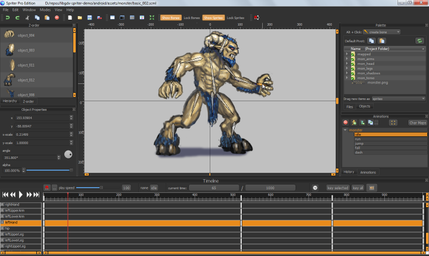
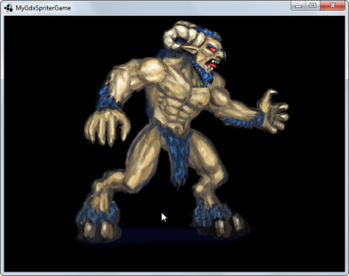

# <a name="Readme">LibGDX + Spriter Demonstration</a>

Demonstration Tutorial on using the awesome [LibGDX game platform][LibGDX]  with the [Spriter Runtime][].  
Produce a multi-platform game using powerful [Spriter 2D animations][Spriter], that run on Android, Desktop, HTML and iOS.

[LibGDX]: https://libgdx.badlogicgames.com
[Spriter]: http://brashmonkey.com
[Spriter Runtime]: https://github.com/Trixt0r/spriter

## Contents
- [Showcase](#Showcase)
- [Credits](#Credits)
- [Requirements](#Requirements)
- [Getting Started](#GettingStarted)
- [Notes](#Notes)

## <a name="Showcase">Showcase</a>

## <a name="Credits">Credits</a>

For most of us, writing good software is about standing on the shoulders of giants.  This demonstration is to showcase the work of others and allow programmers new to the wonders of LibGDX, Spriter, and 2D animation to get a running-start in writing cool 2D games of their own.  

The code in this demonstration includes work from:

- [LibGDX][] by [Badlogic Games][].  
	- A fast, intuitive, multi-platform game development framework. [more...][libgdx-features]
- [Spriter][spriter] by [BrashMonkey][]. 
	- An easy to use, feature rich, 2D timeline / skeletal animation editor. [more...][spriter-features]
- [Spriter Runtime][] by [Heinrich Reich][trixt0r] and [Discobeard][]. 
	- A generic Java importer / runtime for Spriter animation files. [more...][trixt0r-features]

[Badlogic Games]: 	http://www.badlogicgames.com/wordpress/?page_id=2
[libgdx-features]:	https://libgdx.badlogicgames.com/features.html
[BrashMonkey]:     	http://brashmonkey.com/
[Discobeard]:      	https://github.com/Discobeard
[trixt0r]:      	https://github.com/Trixt0r
[spriter-features]: https://brashmonkey.com/spriter-features/
[trixt0r-features]: http://www.youtube.com/watch?v=i_OxqopvMH0

The knowledge to put this demonstration together includes work from:

- [Andoird Developer - Training][android-training]
- [LibGDX Wiki - Developers Guide][LibGDX-Wiki]
- [Trixt0r - Spriter Runtime Readme][trixt0r-readme]

[android-training]: http://developer.android.com/training/index.html
[LibGDX-Wiki]: 		https://github.com/libgdx/libgdx/wiki
[trixt0r-readme]: 	https://github.com/Trixt0r/spriter/blob/master/README.md

To provide feedback or collaborate on this tutorial, contact me at: `github1`[][nul]`@`[][nul]`blueacorn.co.uk`

## <a name="Requirements">Requirements</a> 
List of the Applications / Frameworks used in this feature demonstration.

- [Android SDK Tools][android-sdk]
	- SDK Tools is a downloadable component for the Android SDK. It includes the complete set of development and debugging tools for the Android SDK.
	- You only need the SDK, not the full Android Studio. Install the latest stable platforms via the SDK Manager.
	- Tested with installer_r24.4.1-windows.exe
- [Android Developer Tools for Eclipse (ADT Plugin)][adt-eclipse]
	- Android Development Tools (ADT) is a plugin for the Eclipse IDE that extends the capabilities of Eclipse to develop Android projects ...
	- Eclipse update site: <https://dl-ssl.google.com/android/eclipse/>
	- Tested with ADT 23.0.7 (August 2015)
- Android USB Device / ADB driver 
	- Android USB / ADB Device driver from your device manufacturer.
- [Eclipse IDE for JAVA Developers][eclipse]
	- The essential tools for any Java developer, including a Java IDE, Git client, Gradle and Maven integration
	- Tested with Eclipse IDE for Java Developers - Juno SR2, Windows 32-bit.
- [Gradle Tooling for Eclipse][gradle-eclipse]
	- Gradle Tooling for Eclipse brings you developer tooling for Gradle into Eclipse.
	- Eclipse update site: <http://dist.springsource.com/release/TOOLS/gradle> (for Eclipse < 4.4)
	- Tested with Gradle IDE 3.7.2
- [Java Development Kit (JDK) 7+][oracle-jdk]
	- Tested with Java SE Development Kit 8u73
	- (JDK 6 will not work!)
- [LibGDX][libgdx]
	- Desktop/Android/BlackBerry/iOS/HTML5 Java game development framework
	- Gradle setup application, used to create the project gradle environment with LibGDX dependencies.
	- Tested with LibGDX [gdx-setup.jar][libgdx-jar] nightly\dist  (17-Feb-2016)
- [Spriter][spriter]
	- The Spriter IDE - create animations using key-frames constructed from small, re-useable images (such as body parts) and animating the body parts using bones and . This method of animating offers many benefits for several aspects of a game's development and for the finished product. 
- [Spriter Runtime][]
	- A Generic Java runtime for importing and executing [Spriter][] animation files in your game.
	- Tested with commit [74fe6fd][]  (Nov 27, 2015)
- [Tortoise GIT Client][tortoise]
	- TortoiseGit is a Windows Shell Interface to Git and based on TortoiseSVN.

[74fe6fd]: 		https://github.com/Trixt0r/spriter/tree/74fe6fd8ccd2807f196f25aef4dbbb651f0db5db
[android-sdk]: 	http://developer.android.com/sdk/index.html#Other
[adt-eclipse]: 	http://developer.android.com/tools/sdk/eclipse-adt.html
[eclipse]:     	http://www.eclipse.org/downloads/packages/eclipse-ide-java-developers/junosr2
[gradle-eclipse]: https://github.com/spring-projects/eclipse-integration-gradle/
[oracle-jdk]:  http://www.oracle.com/technetwork/java/javase/downloads/index.html
[tortoise]: 	https://tortoisegit.org/

## <a name="GettingStarted">Getting Started</a>

This is a 'clean-sheet' guide for getting you started from having zero applications installed to having a 2D animated game demonstration fully running on your Desktop and Android device.

### Setup the Developer Environment

1. See [LibGDX Wiki - Setting up your Development Environment][Libgdx-wiki-ide] for full instructions
	1. Install [JAVA SDK 7+][oracle-jdk]
	2. Install [Eclipse IDE for Java Developers][eclipse]
	3. Install [Android SDK Tools][android-sdk]
	4. Install [Android Development Tools for Eclipse][adt-eclipse]
	5. Install [Gradle Tooling for Eclipse][gradle-eclipse]
	6. Optional: See [LibGDX Wiki][Libgdx-wiki-ide] for setting up iOS (not tested)
2. Configure [Android SDK Packages][android-packages] (using Android SDK Manager)
	1. Add Android SDK Build Tools 23.0.1
	2. Add Android SDK Platform Tools
	3. Add Android SDK Platform (API 20)
	4. Optional: Add Android System Image (for Emulator)
3. Install [Android Device USB Drivers][google-usb]
	1. If you have a Google phone: Install [Google USB Driver][google-usb]
	2. If you have a Samsung phone: Install [Samsung USB Driver][samsung-usb]
	3. If you have a different Android device: install the Android USB / ADB driver from your [device manufacturer][oem-usb].
4.	Install [Tortoise GIT Client][tortoise]

[Libgdx-wiki-ide]: https://github.com/libgdx/libgdx/wiki/Setting-up-your-Development-Environment-%28Eclipse%2C-Intellij-IDEA%2C-NetBeans%29
[android-packages]: http://developer.android.com/sdk/installing/adding-packages.html
[google-usb]:		http://developer.android.com/sdk/win-usb.html
[samsung-usb]: 		http://developer.samsung.com/technical-doc/view.do?v=T000000117
[oem-usb]:			http://developer.android.com/tools/extras/oem-usb.html

### Setup Game Project Workspace
LibGDX provides an executable [gdx-setup.jar][libgdx-jar] for creating an initial Eclipse workspace that includes Android, Desktop, Html, iOS and Core projects, with LibGDX dependencies. This setup uses [Gradle][] build files to integrate the project workspace into Eclipse (or your IDE of choice). 

**For this demonstration, just clone the Git project to a folder on your computer.**

1. Clone libgdx-spriter-demo to your computer.
	1. Use Tortoise Git to clone <https://github.com/blueacorn/libgdx-spriter-demo> to your computer.
2. Fetch libgdx-spriter-demo submodules 
	1. Use Tortoise Git to perform Submodule Update on your cloned copy

> When you come to create your own game project, you will want to create a new workspace; with your own package and game file names:
>
> 1. Create LibGDX Project workspace - see [LibGDX - Wiki - Project Setup Gradle][libgdx-setup] for full instructions
> 	1. Run [gdx-setup.jar][libgdx-jar] to create a new game project workspace
>2. Create a 'spriter' project in the root workspace
>   1. Use Tortoise Git to add Spriter Runtime submodule: 
>         - Repository: <https://github.com/trixt0r/spriter>
>         - To Path:    *your-new-workspace*\spriter\libs
>   2. Copy in 'spriter' project and src files:
>      - From: <https://github.com/blueacorn/libgdx-spriter-demo/tree/master/spriter>
>      - To:   *your-new-workspace*\spriter
>   3. Edit workspace 'build.gradle' file to add 'spriter' project dependencies 
>      - See:  <https://github.com/blueacorn/libgdx-spriter-demo/blob/master/build.gradle>
>      - Edit:<*your-new-workspace*\build.gradle> to add in 'spriter' dependencies

[gradle]:		http://gradle.org/whygradle-build-automation/
[libgdx-setup]: https://github.com/libgdx/libgdx/wiki/Project-Setup-Gradle
[libgdx-jar]:   https://libgdx.badlogicgames.com/nightlies/dist/gdx-setup.jar

### Open Workspace in Eclipse
Now that you have your Workspace setup it's time to open it in Eclipse, and build!

1. Import Workspace into Eclipse - See [Eclipse and Grade - Importing][libgdx-wiki-import] for full details
	1. Choose File -> Import 
	2. Select Gradle -> Gradle project, Next
	3. Browse to *your-new-workspace*, Click Build Model
	4. Select all Projects, click Finish
	5. Wait for Gradle for Eclipse plugin to download all other project dependencies 

### Run as Desktop Application

1. In Eclipse, select the 'demo-desktop' project
2. Choose Run > Run 
3. Choose Java Application
4. Choose 'DesktopLauncher' as the main application, click 'OK' to run
5. The Demo Game will now build and run as a Java application on your Desktop
6. Click the 'X' button to close the game

###Run as Android Device Application

1. Ensure you have installed the Android USB / ADB drivers for your device
	1. [How to Install and Use ADB][how-to-adb]
1. Enable your phone for USB Debugging, Unknown Sources
	1. [Android Debug Bridge and Debugging][android-adb]
3. Wait for the drivers to install and the phone to be recognised
4. In Eclipse, select the 'demo-android' project
5. Choose Run > Run
6. Choose Android Application
7. Eclipse should choose the default android application
8. Click Yes to Auto-monitor LogCat (debugging console)
9. Ensure your phone is unlocked
10. The Demo Game will now build and run as an Android application on your Android Device.

[libgdx-wiki-import]: https://github.com/libgdx/libgdx/wiki/Gradle-and-Eclipse#importing-your-project
[how-to-adb]: http://www.howtogeek.com/125769/how-to-install-and-use-abd-the-android-debug-bridge-utility/
[android-adb]: http://developer.android.com/tools/help/adb.html

## <a name="Notes">Notes</a>

*This is a work-in-progress, please Fork, Edit and Push any improvements back to this project, or email me:* 
`github1`[][nul]`@`[][nul]`blueacorn.co.uk`

[nul]: http://nul

---